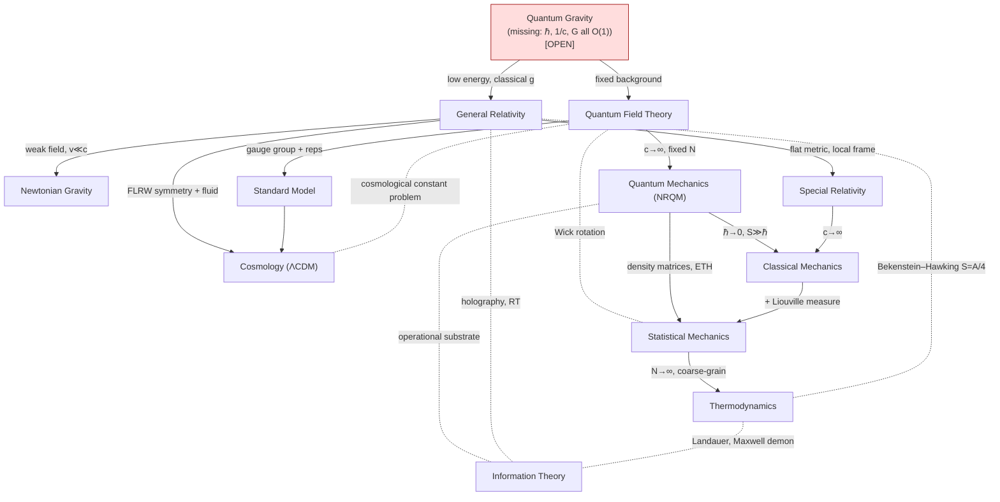

# Theory Map of Physics

Status: Living synthesis — structural overview, cross-linking all domain pages.
Last updated: 2026-06-08

This page is the **atlas** of the wiki: it situates every physical framework relative to every other, exhibits the *reduction structure* (which theory is a limit of which), and lays out the *scale ladder* from the Planck scale to the cosmological horizon. It is deliberately structural rather than exhaustive; per-framework depth lives on the linked [`domains/`](README.md) pages, and the *failures* of the map — the places where frameworks clash rather than nest — are catalogued in [GAPS_AND_CONTRADICTIONS.md](GAPS_AND_CONTRADICTIONS.md). Epistemic markers follow [EPISTEMICS.md](EPISTEMICS.md); load-bearing modeling assumptions are tracked in [ASSUMPTIONS_LEDGER.md](ASSUMPTIONS_LEDGER.md).

A guiding caveat: the words "limit," "reduction," and "emergence" below denote *controlled approximation in a specified regime*, **not** logical derivation in general. Several of the most important limits are mathematically **singular** (e.g. $\hbar\to0$), so "X reduces to Y" almost always means "Y is the leading term of an asymptotic expansion of X, valid where a dimensionless ratio is small." [INFERENCE]

---

## 1. Master table of frameworks

| Domain | Describes | Core math object | Key assumptions | Validity window | Known breakdowns | Page |
|---|---|---|---|---|---|---|
| **Classical mechanics** | Deterministic motion of finitely many bodies | Symplectic manifold $(M,\omega)$; Hamiltonian flow; Poisson algebra | Absolute time; smooth deterministic ODEs; $S\gg\hbar$, $v\ll c$, weak gravity | Celestial mechanics, engineering; verified to extreme precision in regime | $v\to c$ (SR); $S\sim\hbar$ (QM); strong gravity (GR); non-Lipschitz/$N$-body singularities; chaos | [domains/classical-mechanics.md](domains/classical-mechanics.md) |
| **Quantum mechanics (NRQM)** | Non-relativistic quantum systems, finite dof | Rays in complex separable Hilbert space; self-adjoint operators; PVM/POVM | Superposition; Born rule; tensor-product composition; external classical time | Atoms, chemistry, condensed matter, quantum info — no confirmed deviation | $v\to c$ / pair creation (QFT); dynamical gravity (problem of time); measurement cut | [domains/quantum-mechanics.md](domains/quantum-mechanics.md) |
| **Quantum field theory** | Relativistic quantum fields; SM substrate | Operator-valued distributions; path integral $\int\!\mathcal D\phi\,e^{iS/\hbar}$; local algebras (type III) | Microcausality; Poincaré invariance; unitarity; fixed background | QED $g{-}2$ to ~12 sig figs; LHC to ~few TeV; lattice QCD | Planck scale (gravity non-renorm.); $\Lambda$ problem; rigorous 4D construction; Haag's theorem | [domains/quantum-field-theory.md](domains/quantum-field-theory.md) |
| **Particle physics / SM** | EM, weak, strong interactions | Chiral gauge theory $SU(3){\times}SU(2){\times}U(1)$ + Higgs | Local Lorentz-invariant QFT; anomaly cancellation; 3 generations | sub-eV → ~TeV directly, higher indirectly; most-tested theory | $\nu$ mass (confirmed BSM); no DM/DE; hierarchy & strong-CP; baryogenesis | [domains/particle-physics.md](domains/particle-physics.md) |
| **General relativity** | Classical gravitation = spacetime geometry | Lorentzian manifold $(M,g)$; $G_{\mu\nu}{+}\Lambda g_{\mu\nu}=8\pi G\,T_{\mu\nu}$ | Equivalence principle; diffeo invariance; smooth metric; classical $g$ | mm tests → $\sim10^{26}$ m; pulsars, GWs, $\Lambda$CDM | Singularities; Planck scale (perturbative non-renorm.); $\Lambda$ problem; info paradox | [domains/general-relativity.md](domains/general-relativity.md) |
| **Thermodynamics** | Macroscopic energy/heat/entropy at equilibrium | State functions; Legendre transforms; $dU=TdS-pdV+\mu dN$ | Equilibrium exists; extensivity; short-range forces; $N\sim N_A$ | Exact for macroscopic short-range systems | Small/mesoscopic $N$ (fluctuation theorems); gravitating systems; arrow of time origin | [domains/thermodynamics.md](domains/thermodynamics.md) |
| **Statistical mechanics** | Micro → macro bridge | Ensembles; partition function $Z$; $S=k_B\ln W$ | Equal a priori probability; thermodynamic limit; molecular chaos | Equilibrium + short-range; controls fluctuations | Long-range/gravitating; glasses; integrable/MBL (ETH fails); arrow of time | [domains/statistical-mechanics.md](domains/statistical-mechanics.md) |
| **Cosmology** | Dynamics & history of the universe | FLRW metric; Friedmann eqns; $\Lambda$CDM | Cosmological principle; GR on horizon scales; perfect-fluid matter | BBN ($t\sim1$ s) → today, scales $\gtrsim100$ Mpc | Initial singularity; $\Lambda$ problem; dark sector; $H_0$ / $S_8$ tensions | [domains/cosmology.md](domains/cosmology.md) |
| **Information theory** | Quantification & limits of information | Shannon $H$; von Neumann $S(\rho)$; RT surfaces | Observer-independent measure; unitarity; (in gravity) holography | Layer-dependent: exact math → AdS/CFT-only holography | Type-III algebras (no local $S$); BH info paradox; RT outside AdS | [domains/information-theory.md](domains/information-theory.md) |
| **Mathematics for physics** | The rigorous substrate | Hilbert spaces; operator algebras; bundles; measures | Self-adjointness; smooth manifolds; well-defined measures | Rigorous in low-$d$ QFT, finite-dof QM, classical geometry | Lorentzian path-integral measure; 4D YM mass gap; quantization no-go | [domains/mathematics.md](domains/mathematics.md) |

A cross-cutting principle: **the action principle** $\delta\!\int L\,dt=0$ / $\int\mathcal D\phi\,e^{iS/\hbar}$ is the single organizing structure shared from classical mechanics through QFT [ESTABLISHED]; the **symplectic/Poisson structure** survives (deformed) into QM via $\{\,,\}\to[\,,]/i\hbar$ [ESTABLISHED]; the **renormalization group** unifies QFT with critical phenomena in statistical mechanics [ESTABLISHED]. See [UNIFYING_PRINCIPLES.md](UNIFYING_PRINCIPLES.md).

---

## 2. The tower of effective theories (reduction structure)

Each arrow reads **"A reduces to B in the indicated limit"** — B is the effective/low-energy/coarse-grained description, A the more fundamental one. All limits are flagged for singularity.

- **QFT $\xrightarrow{\,c\to\infty,\ \text{fixed }N\,}$ NRQM.** Non-relativistic QM is the fixed-particle-number, low-energy sector of QFT [ESTABLISHED]. QFT *supplies what NRQM postulates*: spin–statistics, antiparticles, and the resolution of one-particle relativistic pathologies. The reduction is **not** representation-preserving: the Stone–von Neumann uniqueness that NRQM relies on **fails** for infinitely many dof (Haag's theorem, inequivalent vacua) [ESTABLISHED]. See [domains/quantum-field-theory.md](domains/quantum-field-theory.md#connections).

- **QM $\xrightarrow{\,\hbar\to0\ (S\gg\hbar)\,}$ classical mechanics.** Recovered via Ehrenfest, WKB/stationary phase, and the Wigner–Moyal map (Moyal bracket $\to$ Poisson bracket) [ESTABLISHED]. The limit is **singular and non-uniform**: $e^{iS/\hbar}$ oscillates without bound, tunneling $\sim e^{-S/\hbar}$ is non-analytic, and for chaotic systems the Ehrenfest time $t_E\sim\lambda^{-1}\ln(S/\hbar)$ truncates correspondence [ESTABLISHED]. Decoherence supplies the *effective* pointer basis; a fully general derivation of classicality is [OPEN]. Definite trajectories and noncontextual values are excluded by Bell / Kochen–Specker [ESTABLISHED].

- **SR / relativistic dynamics $\xrightarrow{\,c\to\infty\,}$ Galilean mechanics.** The relativistic free Lagrangian $-mc^2\sqrt{1-v^2/c^2}\to\text{const}+\tfrac12 mv^2$ [ESTABLISHED]. Absolute time is the $c\to\infty$ contraction of Lorentzian causal structure.

- **GR $\xrightarrow{\,\text{weak field, slow motion}\,}$ Newtonian gravity.** $g_{00}\approx-(1+2\Phi/c^2)$, geodesics $\to\ddot{\mathbf x}=-\nabla\Phi$, and the field equation $\to\nabla^2\Phi=4\pi G\rho$; this limit fixes the coupling $8\pi G/c^4$ [ESTABLISHED].

- **GR (+ matter) $\xrightarrow{\,E\ll M_{\rm Pl}\,}$ GR as an effective field theory.** GR quantized perturbatively is a valid EFT at low energy but perturbatively non-renormalizable at $M_{\rm Pl}$ [ESTABLISHED]. What UV-completes it is [OPEN] — the central problem of [OPEN_PROBLEMS.md](OPEN_PROBLEMS.md).

- **Statistical mechanics $\xrightarrow{\,N\to\infty,\ \text{coarse-grain}\,}$ thermodynamics.** Stat-mech *derives* thermodynamics: $F=-k_BT\ln Z$ reproduces the potentials, $S=k_B\ln W$ grounds entropy [ESTABLISHED]. The reduction has a *subtle residue*: the strict second law is the probabilistic statement's $N\to\infty$ shadow, and irreversibility requires the extra **Past Hypothesis** input that thermodynamics merely posits [INFERENCE/OPEN]. See [domains/statistical-mechanics.md](domains/statistical-mechanics.md) and [GAPS_AND_CONTRADICTIONS.md](GAPS_AND_CONTRADICTIONS.md).

- **Hamiltonian mechanics $\xrightarrow{\,\text{+ Liouville measure}\,}$ statistical mechanics.** Hamiltonian phase-space flow plus Liouville's theorem is the microscopic foundation of the microcanonical ensemble [ESTABLISHED]; the tension is that reversible, volume-preserving microdynamics cannot *alone* produce monotone entropy increase (Loschmidt, Zermelo) [ESTABLISHED tension].

- **Euclidean QFT $\;\cong\;$ classical statistical field theory** (Wick rotation, Osterwalder–Schrader). Not a reduction but a *formal isomorphism*: the path integral *is* a partition function, and Wilsonian RG is literally shared [ESTABLISHED, where reflection positivity holds]. See [domains/mathematics.md](domains/mathematics.md).

- **SM $\xrightarrow{\,\text{leading operators}\,}$ SMEFT / low-energy EFTs** (chiral perturbation theory, Fermi theory). Renormalizability is *not* a fundamental axiom but an emergent low-energy property: irrelevant operators are suppressed by powers of $E/\Lambda$ [ESTABLISHED, Wilsonian reinterpretation].

**Diagrammatic note.** The tower is **not** a single linear chain. Three deformation parameters act quasi-independently — $\hbar$ (quantum), $1/c$ (relativistic), $GM/rc^2$ (gravitational) — plus a coarse-graining/$N$ axis. The "missing corner" where all of $\hbar$, $1/c$, and $G$ are simultaneously $O(1)$ is **quantum gravity**, which no current framework occupies [OPEN]. See [UNIFICATION_LANDSCAPE.md](UNIFICATION_LANDSCAPE.md).

---

## 3. Relationship diagram

**Solid arrows** = controlled reduction (limit/coarse-graining). **Dashed lines** = structural correspondence or shared formalism, not a reduction. The triple point **GR ∩ QFT/QM ∩ thermodynamics** (black-hole thermodynamics, the information paradox, $S=A/4$) is the densest cluster of [OPEN]/[CONTESTED] problems in physics. See [GAPS_AND_CONTRADICTIONS.md](GAPS_AND_CONTRADICTIONS.md) and [domains/information-theory.md](domains/information-theory.md).

---

## 4. The scale ladder: from Planck to the horizon

Energies in GeV, lengths in metres; values are standard constants, not invented. The "ruling framework" column states which theory is *operationally correct* at that scale; arrows indicate where one framework hands off to another.

| Scale (energy / length) | Regime | Ruling framework | Notes |
|---|---|---|---|
| $E_{\rm Pl}\approx1.22\times10^{19}$ GeV; $\ell_{\rm Pl}\approx1.6\times10^{-35}$ m | Quantum gravity | **None established** [OPEN] | Curvature $\sim\ell_{\rm Pl}^{-2}$; metric fluctuations $O(1)$; GR-as-EFT and QFT both fail |
| $\sim10^{16}$ GeV | GUT / proton decay | SM as EFT; GUTs [SPECULATIVE] | Gauge couplings near-unify (better with SUSY); $\tau_p>10^{34}$ yr excludes minimal $SU(5)$ |
| $\sim10^{9}$–$10^{15}$ GeV | Seesaw / inflation / baryogenesis | QFT + cosmology [INFERENCE] | $\nu$-mass seesaw scale; inflaton sector; leptogenesis — none directly probed |
| $\sim246$ GeV ($v$); $\sim100$ GeV–few TeV | Electroweak; collider frontier | **Standard Model** [ESTABLISHED] | Higgs mechanism: $M_W=\tfrac12 gv$, $M_Z=\tfrac12\sqrt{g^2+g'^2}\,v$; LHC reach |
| $\sim0.2$ GeV ($\Lambda_{\rm QCD}$) | Confinement / hadrons | Nonperturbative QCD (lattice) [ESTABLISHED] | Quark–gluon → hadron description switch; perturbation theory fails |
| $\sim$ MeV–keV | Nuclear, atomic; BBN | QM + QED; QFT for precision | $g{-}2$ to ~12 sig figs; BBN at $T\sim1$ MeV, $t\sim1$ s |
| $\sim$ eV and below | Chemistry, condensed matter | **NRQM** [ESTABLISHED] | Classical mechanics emerges where $S\gg\hbar$ and decoherence acts |
| Macroscopic ($N\sim N_A$) | Bulk matter, engines | Classical mechanics; thermodynamics | Stat-mech bridges to micro; fluctuations $\sim N^{-1/2}$ |
| Solar system → galactic ($\sim10^{20}$ m) | Gravitational dynamics | **General relativity / Newtonian** [ESTABLISHED] | PPN tests; pulsars; GW sources; rotation curves require dark matter |
| $\gtrsim100$ Mpc → $\sim10^{26}$ m (horizon) | Cosmological | **GR + $\Lambda$CDM** [ESTABLISHED] | Cosmological principle holds statistically; $H_0$/$S_8$ tensions [CONTESTED] |
| Cosmological horizon / de Sitter | Global structure | GR; holography [SPECULATIVE outside AdS] | de Sitter entropy by analogy with BH; RT/holography unestablished here |

Numerical anchors for the dimensionless ratios that switch frameworks live in [CONSTANTS_AND_SCALES.md](CONSTANTS_AND_SCALES.md): $\hbar$, $c$, $G$, $k_B$, $M_{\rm Pl}=\sqrt{\hbar c/G}$, $\alpha\approx1/137$, $\Lambda\sim10^{-52}$ m$^{-2}$, and the Bekenstein–Hawking entropy $S_{\rm BH}=k_B c^3A/4G\hbar$.

---

## 5. Where the map tears (pointers, not content)

The reductions above are the *successes*. The wiki's value concentrates in the *failures* — pairs of frameworks that do not nest cleanly. These are catalogued in full in [GAPS_AND_CONTRADICTIONS.md](GAPS_AND_CONTRADICTIONS.md); a structural index:

- **QM/QFT ∩ GR — quantum gravity & the problem of time.** QM/QFT presuppose a fixed classical background and external time; GR makes spacetime dynamical (Wheeler–DeWitt $H|\Psi\rangle=0$ is timeless). Perturbative quantization is non-renormalizable. The sharpest clash in physics [ESTABLISHED that it is unresolved]. See [OPEN_PROBLEMS.md](OPEN_PROBLEMS.md).
- **QFT ∩ GR ∩ cosmology — the cosmological constant problem.** Naive QFT vacuum energy exceeds observed $\rho_\Lambda$ by $\sim10^{60}$–$10^{120}$ [OPEN]. A domain-clash, possibly the deepest quantitative mismatch known.
- **Reversible microdynamics ∩ thermodynamics — the arrow of time.** Time-symmetric mechanics + thermodynamic arrow forces a low-entropy boundary condition (Past Hypothesis), whose origin is cosmological and [OPEN].
- **The measurement problem.** Unitary evolution (A5) and the projection postulate (A6) are jointly applied with no rule demarcating their jurisdictions [OPEN/CONTESTED]. A genuine incompleteness, not a domain mismatch — distinct in kind. See [domains/quantum-mechanics.md](domains/quantum-mechanics.md).
- **Black-hole thermodynamics & information.** $S_{\rm BH}=A/4$ and Hawking radiation place thermodynamics, QM (unitarity), and GR at a triple point; the information paradox and microstate counting are [OPEN/CONTESTED]. See [domains/information-theory.md](domains/information-theory.md) and [domains/thermodynamics.md](domains/thermodynamics.md).
- **Rigor gap.** No physically realistic interacting 4D QFT is rigorously constructed (Yang–Mills mass gap, a Clay problem); the Lorentzian path-integral measure does not exist as a measure [OPEN]. See [domains/mathematics.md](domains/mathematics.md).

A discipline of classification (per [EPISTEMICS.md](EPISTEMICS.md)): distinguish a **true logical inconsistency** (none confirmed between accepted frameworks), a **domain-of-validity mismatch** (most "clashes" above — e.g. QFT-on-fixed-background vs dynamical GR), and an **unsolved-but-consistent problem** ($\Lambda$CDM dark sector, confinement proof, glass transition).

---

## See also

- [README.md](README.md) — wiki entry point and reading order
- [THEORY_MAP.md](THEORY_MAP.md) (this page) ↔ [UNIFICATION_LANDSCAPE.md](UNIFICATION_LANDSCAPE.md) — candidate UV completions and unification routes
- [UNIFYING_PRINCIPLES.md](UNIFYING_PRINCIPLES.md) — the action principle, symmetry↔conservation, RG, holography
- [GAPS_AND_CONTRADICTIONS.md](GAPS_AND_CONTRADICTIONS.md) — full catalogue of inter-framework clashes
- [OPEN_PROBLEMS.md](OPEN_PROBLEMS.md) · [HYPOTHESES.md](HYPOTHESES.md) · [ASSUMPTIONS_LEDGER.md](ASSUMPTIONS_LEDGER.md)
- [CONSTANTS_AND_SCALES.md](CONSTANTS_AND_SCALES.md) — the constants that set the scale-ladder transitions
- [EPISTEMICS.md](EPISTEMICS.md) — meaning of the inline markers · [GLOSSARY.md](GLOSSARY.md) · [FINDINGS.md](FINDINGS.md)
- Domain pages: [classical-mechanics](domains/classical-mechanics.md) · [quantum-mechanics](domains/quantum-mechanics.md) · [quantum-field-theory](domains/quantum-field-theory.md) · [particle-physics](domains/particle-physics.md) · [general-relativity](domains/general-relativity.md) · [thermodynamics](domains/thermodynamics.md) · [statistical-mechanics](domains/statistical-mechanics.md) · [cosmology](domains/cosmology.md) · [information-theory](domains/information-theory.md) · [mathematics](domains/mathematics.md)

## References

See [BIBLIOGRAPHY.md](BIBLIOGRAPHY.md) for canonical sources underlying each framework (e.g. von Neumann and Reed–Simon for QM foundations; Weinberg, Haag, and Streater–Wightman for QFT; Wald and Misner–Thorne–Wheeler for GR; Callen and Jaynes for thermodynamics/statistical mechanics; Arnold for classical mechanics; Nielsen–Chuang for quantum information). Per wiki policy ([AGENTS.md](AGENTS.md)), only real, standard sources are cited; specific landmark results (Gleason, Stone–von Neumann, Haag, Lovelock, Coleman–Mandula, Penrose–Hawking, Aizenman–Duminil-Copin, Ryu–Takayanagi) are named on the relevant domain pages.
